<picture>
  <source media="(prefers-color-scheme: dark)" srcset="./assets/dark.svg">
  <source media="(prefers-color-scheme: light)" srcset="./assets/light.svg">
  
</picture>

I'm a Software Engineer passionate about backend development, enterprise software, and scalable web applications. I enjoy designing clean architectures, building RESTful APIs, and solving real-world problems through technology.

Currently working as a **Full Stack Developer**, building enterprise systems and internal platforms using Laravel, CodeIgniter, PHP, JavaScript, SQL databases, and modern development practices.

---

## 🚀 About Me

* 💼 Software Engineer with experience in enterprise software development.
* 🔗 Specialized in backend development and REST API design.
* 🏛️ Building digital solutions for businesses and public institutions.
* 🗄️ Experience with relational database design and optimization.
* ⚡ Passionate about writing clean, maintainable, and scalable code.
* 🌱 Constantly learning new technologies and software architecture patterns.

---

# 🛠 Tech Stack

### Programming Languages

---

### Backend

---

### Frontend

---

### Databases

---

### Data Science

---

### Tools & DevOps

---

## 📫 Connect with Me

* 💼 LinkedIn: [www.linkedin.com/in/miguel-ángel-gonzalez-santillan-3197b0279](http://www.linkedin.com/in/miguel-ángel-gonzalez-santillan-3197b0279)
* 📧 Email: [miguelglezedu@gmail.com](mailto:miguelglezedu@gmail.com)
* 🌐 Portfolio: Coming soon...

---

> *"Code with purpose. Build with quality. Never stop learning."*
